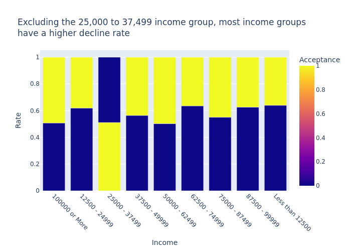

# Coupon-Assessment

A repository focused on assessing the likelihood of a customer accepting a coupon

## Link to primary & report notebook

[Primary Notebook](https://github.com/mattdabit/Coupon-Assessment/blob/main/prompt.ipynb)

[Report Notebook](https://github.com/mattdabit/Coupon-Assessment/blob/main/eda.ipynb)

## Local Installation

1. Clone the repository
2. Use a python environment manager. I prefer conda.
3. Create and activate conda environment
    ```
    conda create -n coupon python 
    conda activate coupon
    ```
4. Install dependencies
    ```
    pip install -r requirements.txt 
    # or 
    pip3 install -r requirements.txt
    ```
5. Use your preferred IDE or Jupyter notebook. I like setting up a kernel if I use Jupyter. I typically use my ide.
    ```
    python -m ipykernel install --user --name=coupon
    ```

The following analysis was taken from the Report Notebook.

# Exploratory Data Analysis of Coupon Acceptance

## About the Dataset

This dataset describes different driving scenarios and asks the driver if they are willing to accept a coupon. The
dataset includes demographical data and situational factors for the driver. The dataset contains multiple coupon types
but I decided to focus on bars and more expensive restaurants (\$20 - \$50). The dataset is
available [here](https://github.com/mattdabit/Coupon-Assessment/blob/main/data/coupons.csv). An explanation of all the
columns and all the code I wrote for this analysis can be
found [here](https://github.com/mattdabit/Coupon-Assessment/blob/main/prompt.ipynb). You will find most of the contents
of this file to be in the aforementioned link as well.

### Problematic Data Analysis

## Problematic Data Analysis

Concerning the dataset, I can see that only six columns contain missing data and 74 rows are duplicates.
I decided to drop the duplicates because there were so few.
These six columns include `Restaurant20to50`, `RestaurantLessThan20"`, `CarryAway`, `CoffeeHouse`, `Bar` and `car`.
All of these columns are categorical features.
All but the `car` column are missing data less than or equal to `1.7%` of the time.
The `car` column is the most sparse by being unavailable `99.1%` of the time.
Considering these findings, I will drop the `car` column even though it can be useful to know.
I simply can't impute that much data or assume the user is in a car with confidence.
The five other columns concern the user's behavior and how often they visit that type of business.
Even without visualizing the dataset I can infer that these columns are important
and given that so few of these data are missing I ought to keep it.
The question now is how to impute that data.
One naive approach could be to impute the most frequent response or to impute a response of `never`,
assuming that what the user meant.
Either way these would be guesses.
Another way of imputing these columns are to leverage a k-clustering algorithm.
You would find the top 5 nearest neighbors of a row with missing values
and impute the most frequent response of the nearest neighbors.
This is an advance technique that I am not confident I can pull off just yet.
I do know how to leverage SMOTE (Synthetic Minority Oversampling Technique)
however that is for minority datasets and is a library I have used before.
I mention SMOTE because it uses k-clustering to create synthetic data and my earlier suggestion was inspired by SMOTE.
For the purpose of this project I will impute the most frequent response.
Above is a table showing their most frequent responses.
These have a frequency from `25%--50%`.
These six columns include `Restaurant20to50`, `RestaurantLessThan20"`, `CarryAway`, `CoffeeHouse`, `Bar` and `car`.
All of these columns are categorical features.
All but the `car` column are missing data less than or equal to `1.7%` of the time.
The `car` column is the most sparse by being unavailable `99.1%` of the time.
Considering these findings, I will drop the `car` column even though it can be useful to know.
I simply can't impute that much data or assume the user is in a car with confidence.
The five other columns concern the user's behavior and how often they visit that type of business.
Even without visualizing the dataset I can infer that these columns are important
and given that so few of these data are missing I ought to keep it.
The question now is how to impute that data.
One naive approach could be to impute the most frequent response or to impute a response of `never`,
assuming that what the user meant.
Either way these would be guesses.
Another way of imputing these columns are to leverage a k-clustering algorithm.
You would find the top 5 nearest neighbors of a row with missing values
and impute the most frequent response of the nearest neighbors.
This is an advance technique that I am not confident I can pull off just yet.
I do know how to leverage SMOTE (Synthetic Minority Oversampling Technique)
however that is for minority datasets and is a library I have used before.
I mention SMOTE because it uses k-clustering to create synthetic data and my earlier suggestion was inspired by SMOTE.
For the purpose of this project I will impute the most frequent response.

## Bar Coupon Acceptor Analysis

### General Coupon Acceptance vs Bar Coupon Acceptance

In the 12,784 observations, coupon acceptance was at **~57%** but bar coupon acceptors stood at **~41%**.

Contrast general coupon acceptance:


With bar coupon acceptance:


### Bar Coupon Acceptance x Bar visits

As I began to drill down into further categories, I began to unveil which features best represented the bar coupon
acceptor minority group. I quickly found that those that accepted the bar coupon went to a bar more often than those
that declined. This is intuitive. _People who go more often to a place are more willing to accept a coupon for that
place than those that do not._


### Bar Coupon Acceptance x Age

The next feature I looked at was age. My gut feeling was that those under 25 would be people more likely to accept a bar
coupon. However, I was wrong and it seems like I forgot what it is like to be 21–25. _People in this age group are
either just starting their careers or are in college, meaning money is sparse and probably shouldn't be spent at a bar._
People in this group don't need to go to a bar to drink with friends, they can just drink beers or sip wine on the couch
with their friends. I recollect that I didn't frequent bars at those ages simply because of cost. The following graph
shows this disparity.


### Bar Acceptance x Goes to Bar once a month x Passenger not a kid x Not in Farming, Fishing or Forestry

These combinations of conditions represented a different kind of individual. We filtered out those who drove alone or
with children. We then filter out those who worked in farming, fishing or forestry. I imagine these occupations are
further away from city life. I also filtered out those that do not go to bars once a month. This shows a very different
picture. _Users fitting these traits accepted the coupon at a very high rate._


### More complicated categories

Finally, I looked at drivers who met the following characteristics:

- go to bars more than once a month, had passengers that were not a kid, and were not widowed *OR*
- go to bars more than once a month and are under the age of 30 *OR*
- go to cheap restaurants more than 4 times a month and income is less than 50K.

These characteristics represent 3 distinct types of people. Although the acceptance rate for these characteristics was
not as high as the previous properties, it gave us a _new segment or cluster of people to target with bar coupons._


### Bar Coupon Acceptor Analysis Conclusion

This exercise shows us to not generalize entire populations without considering what makes individuals within that
population unique. In short, you need to know your customer. Even within your targeted customer group, you will have sub
groups/clusters within that group that will respond to different stimuli. It was a red herring to assume that the
average acceptance rate for bar coupons could be generalized amongst a broader population. As we began to break down the
elements of the drivers, we found what traits would lead to higher acceptance rates. We now know a little bit more about
who target with bar coupons. This informs us we should do a similar exercise for the other coupon types. If we repeat
this process we can improve our overall coupon acceptance rate by targeting those more likely to accept the type of
coupon we send them.

## Restaurant(20-50) Coupon Acceptance Analysis

In the 12,784 observations, coupon acceptance was at **~57%** but expensive restaurant coupon acceptors stood at **~44%
**. This was a surprising result to me. I would have expected coupon acceptance to be higher for the more expensive
places. I would have expected more people to accept the coupon because it was more expensive.

Compare general coupon acceptance:


With expensive restaurants:


### Restaurant(20-50) Coupon Acceptance Analysis by Visits

This analysis was obvious but I felt it prudent to double check. As anyone would expect, _a person is more likely to
accept the coupon if they visit that type of place more often._


### Restaurant(20-50) Coupon Acceptance Analysis by distance and direction

I decided to see how much distance and direction mattered. I expected that if you are close and in the same direction
you would be more likely to accept the coupon. I found a _2% increase in acceptance rate for people who are close and in
the same direction_. Not as much as I expected but every single percentage point counts.


### Restaurant(20-50) Coupon Acceptance Analysis by Income

I then adjusted my gaze towards income. I thought to myself that there should be a higher acceptance rate for people
with higher incomes. But I was wrong. In fact, there does not seem to be a correlation at all. Interestingly, the *
*25,000 to 37,499 income group has a higher acceptance rate, 51% accepted**. This finding got me thinking about the
desire to make a good impression for a partner.



### Restaurant(20-50) Coupon Acceptance Analysis by Marital Status

I believe I was right to look at marital status, considering the above finding about income. I was not surprised to see
that someone who was not married but had a partner was more likely to accept the coupon, _4% more likely than the
general population_. It also wasn't surprising to see that singles were 2% more likely to accept the coupon.


### Restaurant(20-50) Coupon Acceptance Analysis by Passenger

Now that I have seen the acceptance rates by marital status, I thought surely if the partner was in the car they would
be more likely to accept the coupon. I was very right. I found that if you are _with your partner you will accept the
coupon 63% of the time._


### Restaurant(20-50) Coupon Acceptance Analysis by Gender

I was now interested to see if there was a difference between males and females. I found that males were 3% more likely
to accept the coupon than females. I wanted to drill into this comparison further.


### Restaurant(20-50) Coupon Acceptance Analysis—Males with an opportunity to impress their partner

I wanted to see if there was a difference between males with an opportunity to impress their partner and males without.
I did this by creating `male_with_impressing_opportunity` which would be true if the male had a partner and no kids or
if the male was in the car with a partner. I found that males with an opportunity to impress their partner were **5%
more likely to accept the coupon** than males without. This was a considerable jump so I wanted to see how income
affected this.


### Restaurant(20-50) Coupon Acceptance Analysis—Males with an opportunity to impress their partner with lower income

I defined lower income as anything lower than \$62,499. I found that males with an opportunity to impress their partner
with lower income were _3% more likely_ to accept the coupon than males without.


### Restaurant(20-50) Coupon Acceptance Analysis—Females with an opportunity to impress their partner

Now I desired to compare males with females. Females when given the chance to impress their partner with an expensive
date were _2% more likely to accept the coupon than females without._


### Restaurant(20-50) Coupon Acceptance Analysis—Females with an opportunity to impress their partner with lower income

Given this I began to think that lower income females would also be more likely to accept the coupon to impress their
partner. I was not wrong. **47% of this group** accepted the coupon versus the 43% outside this group.


### Restaurant(20-50) Coupon Acceptance Analysis - Male/Female with Impressing Opportunity Subplots

I decided to put all of these plots together to get a better picture and tell a better story. In the following image,
you will see that when it concerns coupons for expensive restaurants if given the opportunity those with a partner are
more likely to accept the coupon. This is likely due to the fact that these individuals would love the chance to treat
their partner to a nicer meal. I found this finding quite wholesome.


### Restaurant(20-50) Coupon Acceptance Analysis Conclusion

In conclusion, I found that we can increase the rate of acceptance for expensive restaurant coupons by targeting certain
attributes in the dataset. Proximity and direction had a moderate impact on acceptance but income showed no
correlation (barring 1 income bracket). Particularly, relationship dynamics were of keen interest to me. People with
partners but not married were more likely to accept a coupon. There was a gender dynamic going on here too. Both genders
were out to impress, however females of lower income had a stronger boost than males of a lower. These findings suggest
that targeting couples, particularly those with partners present would be more effective than targeting other dynamics.
The data reveals a wholesome pattern where both females and males are more likely to accept a coupon to treat their
partners to a nice meal.

## Expensive Restaurant Coupon Acceptance Model Analysis (Side quest)

I decided to create two models for expensive restaurant coupon acceptance. A decision tree and a random forest model.
For these models, I decided to only look at the columns I analyzed. I wanted to see if there was a difference between
the two models, since I have seen the difference before at work. I fully expected the random forest to perform better. I
found that the random forest was easier to tune by threshold. It also looks like the decision tree model had no
differences between certain thresholds. Because we are only looking to predict the coupon acceptance, I believe
precision metric should be our best metric. From these models, the max precision was 70% and I would recommend that for
use. Precision will help minimize the number of false positives. In this case, people who we predict will accept but
actually decline the coupon. From a business perspective, this means more efficient targeting. We will reduce the
feeling of spam from sending coupons to less likely to accept individuals. However the poor recall metric will mean we
will have a lot of missed opportunities. This should be a target area for future research. With better feature discover
we should end up with a better model.


## Next steps

1. Examine more coupon types
2. Explore more features for each coupon type
3. Explore more features for the general population to compare to get a sense of overall trends
4. Present current suggestions to business leaders
5. If possible, enrich the dataset with more features. I think socials would be a great addition.
6. Use and improve the model!

## Heads up

The model's performance will change for you. There is an element of randomness to model creation. You mitigate this by
pickling the model object. This would prevent such a problem.